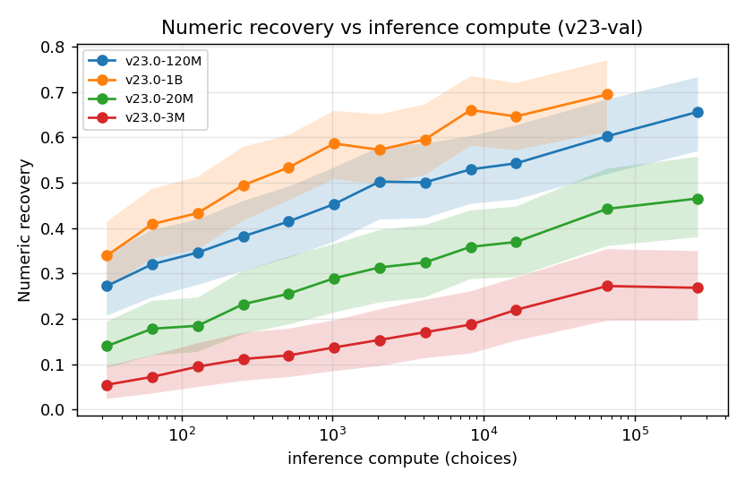
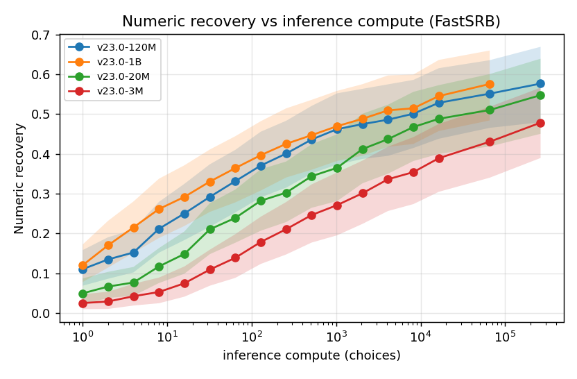
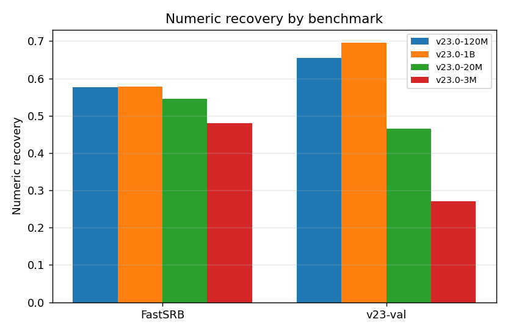
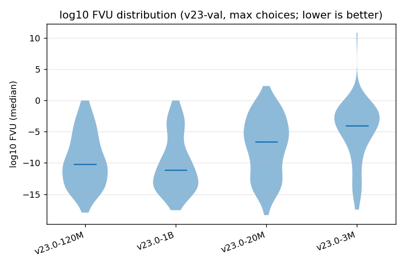

# Results & analysis

`srbf` separates *running* a benchmark from *analysing* it (see [Running evaluations](running.md) for
the raw stage). A run emits **raw results only**; metrics and the results page are a **separate,
standardized stage** so the numbers are reproducible from the raw records and never baked into a run.

```
Benchmark.run()  ->  raw snapshot        (per-problem predictions + targets)
derive_metrics   ->  + derived metrics   (FVU, numeric/symbolic recovery, F1, ...)
srbf.analysis    ->  the four views      (leaderboard, scaling, per-benchmark, distributions)
```

Because the data sources are **unseeded** (reproducibility comes from fixed catalogs, not seeds),
every headline is reported as a **distribution over expressions with a bootstrap confidence
interval**, not a single seeded point. Per-expression draws are grouped by `benchmark_eq_id`.

## Preliminary results

> **Preliminary -- archived provenance.** These numbers are **re-rendered through `srbf.analysis`
> from the archived flash-ansr v23.0 evaluation** (the first paper's results), *not* from a fresh
> canonical run. Provenance is heterogeneous and predates the current package family:
> **flash-ansr = `v23.0-{3M,20M,120M,1B}`; symbolic-data / srbf / the catalog artifacts = `-`** (they
> did not exist at eval time -- the runs used flash-ansr's own pre-carve pipeline). Numeric recovery is
> the strict `is_perfect_fit` (vNRR) on the validation points; Skeleton F1 is token-level; FVU is the
> median `log10` FVU. **Symbolic recovery is omitted here**: the archived predicted skeletons are not
> normalized to the current `simplify`, so an exact-match metric reads artifactually near zero. A fresh
> [canonical run](#the-canonical-run) restores it and supersedes these numbers.

### Leaderboard (best of the inference-compute sweep, pooled over benchmarks)

| Model | N expr | Choices | Numeric recovery | Skeleton F1 | log10 FVU (median) |
|---|---|---|---|---|---|
| v23.0-1B | 199 | 65536 | 0.630 [0.571, 0.689] | 0.714 [0.684, 0.743] | -9.206 [-9.943, -8.418] |
| v23.0-120M | 196 | 262144 | 0.612 [0.547, 0.673] | 0.711 [0.679, 0.739] | -8.926 [-9.730, -8.139] |
| v23.0-20M | 196 | 262144 | 0.509 [0.447, 0.575] | 0.684 [0.651, 0.713] | -7.597 [-8.379, -6.773] |
| v23.0-3M | 195 | 262144 | 0.385 [0.325, 0.450] | 0.649 [0.616, 0.680] | -6.063 [-6.922, -5.214] |

Median with a 95% bootstrap CI over expressions. Bigger models win on every metric; note the 1B run
only reached 65536 choices (not 262144), so its headline is at a lower compute budget than the rest.

### Scaling: recovery vs inference compute

Recovery rises monotonically with the inference-compute budget (`choices`) for every model size, and
at every budget a larger model recovers more -- the two scaling axes compound.



On the harder **v23-val** set the model-size gap is large (3M reaches ~0.27 at the top budget vs 1B ~0.70).



On the easier **FastSRB** set the same compute trend holds but the sizes converge much closer
(all four between ~0.48 and ~0.58 at high compute).

### Per-benchmark breakdown



FastSRB saturates across sizes, while v23-val discriminates model size strongly -- the same result
seen in the scaling curves, at each model's best compute budget.

### Distribution



The per-expression fit-quality (`log10` FVU; lower is better) mass shifts lower as the model grows;
the 3M model carries a heavy tail of poorly-fit expressions that the larger models mostly resolve.

## The four standardized views

`srbf.analysis` turns a set of runs -- each a raw snapshot tagged with `(model, benchmark, scaling)` --
into four views (`Metric` = a snapshot column + a display label + its polarity):

- **Leaderboard** (`leaderboard`): one row per model/baseline; each metric a bootstrap median + 95% CI
  pooled over the benchmarks at a chosen scaling coordinate.
- **Scaling** (`scaling_figure`): a metric vs the scaling coordinate (e.g. inference compute), one line
  + CI band per model.
- **Per-benchmark breakdown** (`per_benchmark_figure`): the metric split by benchmark
  (FastSRB / Feynman / Nguyen / ...), so per-suite strengths and weaknesses are visible.
- **Distribution** (`distribution_figure`): the per-expression distribution of a metric per model
  (violin), honouring the "report the distribution, not a point" policy.

## Producing the page

`build_report` renders all four views to a Markdown page (`results.md`) plus PNG figures. Figures
need the optional `analysis` extra:

```sh
pip install 'srbf[analysis]'   # adds matplotlib; tables/leaderboards need no extra
```

From Python, feed it the runs directly:

```python
from srbf import Benchmark
from srbf.analysis import RunResult, build_report

runs = []
for (model, benchmark, scaling, config) in canonical_grid:      # your model x benchmark x scaling grid
    (bench,) = Benchmark.runs_from_config(config)
    runs.append(RunResult(model=model, benchmark=benchmark, scaling=scaling, snapshot=bench.run()))

build_report(runs, out_dir="docs", engine=bench.model_adapter.get_simplipy_engine())
```

Or, from the command line, describe the runs in a small manifest and let `srbf analyze` load them:

```yaml
# results_manifest.yaml -- each `path` is a pickled raw snapshot (a Benchmark.run() output)
runs:
  - {model: flash-ansr-120M, benchmark: fastsrb, scaling: 4096, path: 120M_fastsrb_4096.pkl}
  - {model: flash-ansr-3M,   benchmark: fastsrb, scaling: 4096, path: 3M_fastsrb_4096.pkl}
  - {model: brute-force,     benchmark: fastsrb,                path: bf_fastsrb.pkl}
```

```sh
srbf analyze results_manifest.yaml -o docs --title "Symbolic Regression Benchmark Results"
```

This writes `docs/results.md` (a leaderboard table) plus `docs/figures/{scaling,per_benchmark,distribution}.png`.

## The canonical run

The **canonical results** the published page reports come from the sweep configs under
`configs/evaluation/scaling/` (the model x inference-compute ladder over the shared `fastsrb`
validation benchmark). Reproduce them end to end:

```sh
srbf run -c configs/evaluation/scaling/<config>.yaml       # -> one result pickle per resolved !sweep run
# collect the pickles into results_manifest.yaml (model / benchmark / scaling / path)
srbf analyze results_manifest.yaml -o docs
```

The canonical run is a compute job (real models over the benchmark); the analysis stage above is
cheap and deterministic given the raw pickles, so the page regenerates in seconds whenever the raw
results change.
